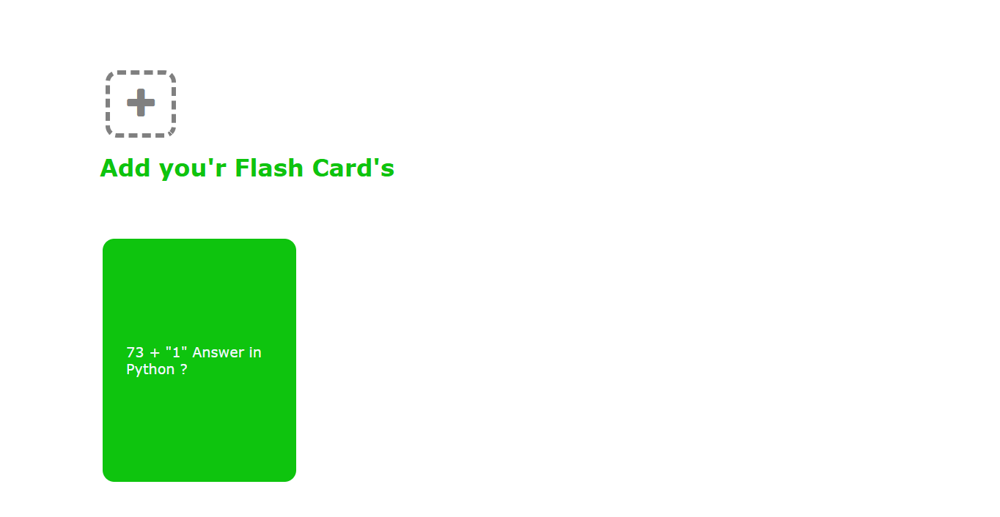

# Flashcard App

## Project Description

The Flashcard App is a web-based application designed to help users learn and memorize information through the use of flashcards. Users can create flashcards with questions and answers, view all their flashcards, and test their knowledge in quiz mode. The app stores flashcards in the browser's local storage, ensuring that users' data persists even after refreshing the page.

## Features

### User Features
- **Add a New Flashcard**: Users can create flashcards by entering a question and an answer.
- **View All Flashcards**: Users can see a list of all their created flashcards.
- **Local Storage**: Flashcards are stored in local storage for persistence.

## User Interface Design

### Main Page
- **Header**: Title of the app (e.g., "Flashcard App").
- **Form to Add a New Flashcard**:
  - Input field for the question.
  - Input field for the answer.
  - Button to submit the new flashcard.
- **List of Existing Flashcards**: Display all flashcards with options to edit or delete.
- **Button to Start Quiz Mode**: Initiates the quiz functionality.

### Quiz Mode
- **Display One Question at a Time**: Users see one question and can input their answer.
- **Feedback Mechanism**: Users receive feedback on their answer.
- **Navigation**: Button to go to the next question.

## Technology Stack

### Frontend
- **HTML**: For structuring the content of the web application.
- **CSS**: For styling the application (consider using a CSS framework like Bootstrap for quick styling).
- **JavaScript**: For implementing the functionality and interactivity of the app.

### Storage
- **Local Storage**: Used to save flashcards so they persist even after the page is refreshed.

## Getting Started

### Prerequisites
- A web browser (e.g., Chrome, Firefox, Safari).
- A code editor (e.g., Visual Studio Code, Sublime Text) for viewing and editing the code.

 
